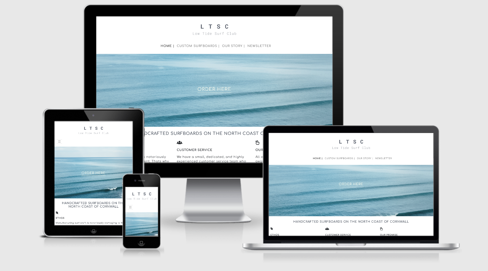

# Low Tide Surf Club | Custom Surfboards Website

[View live project here](https://liammcluckie.github.io/Low-Tide-Surf-Club/)



## Overview

This is the main marketing and product ordering page for a fictional company who specialise in building custom surfboards
based in Cornwall, UK. The site will be responsive and accessible on all devices, however, primarily the site will be aimed
at desktop users due to the form process for placing an order being much easier to complete on this device. The site will be
easy to navigate, enjoyable to use, and contain all the information needed regardless of the prior knowledge the user has.

## Table of contents
### 1. [UX](#ux)
#### 1a. [User Stories](#user-stories)
#### 1b. [Business Goals](#business-goals)
#### 1c. [User Centered Design](#user-centered-design)
- Strategy Plane
- Scope Plane
- Structure Plane
- Skeleton Plane
### 2. [Design](#design)
- Colour Scheme
- Typography
- Imagery
- Logo
### 3. [Features](#features)
### 4. [Technologies Used](#technologies-used)
- Syntax 
- Frameworks, Libraries & Programs
- Resources
### 5. [Testing](#testing)
- [Testing document](TESTING.md)
### 6. [Deployment](#deployment)
- GitHub Pages
- Forking the Repository
- Cloning the Repository
### 7. [Credits](#credits)
- Code
- Content
- Media
- Acknowledgements

## UX
### User Stories
- First Time Visitor Goals

    a. As a first time visitor, I want to gain understanding of the purpose for this site and the intentions of the
    business. Including explanative information in case the user does not having a strong understanding of the product.

    b. As a first time visitor, I want to easily find the product information that I visited the site for,
    As well as have an enjoyable experience aesthetically and find using the websites features simple.
            
    c. As a first time visitor, I want to look for previous products created to ensure that using this company is the
    right decision. I would expect to find these not only through social media links but also a gallery page,
    providing customer testimonials would enhance this.

- Returning Visitor Goals

    a. As a returning visitor, I want to be able to easily order a product custom to my specifications in a
    reasonably quick manor.

    b. As a returning visitor, I want to be able to find alternative ways to contact the company other than the order
    form. This is in case of needing to alter my order, or to request an update.

    c. As a returning visitor, I want to be able to find out further information about the company and brand. This
    includes new products, design and background history.

- Frequent Visitor Goals

    a. As a frequent visitor, I want to easily be able to sign up to a newsletter so that I always find out about 
    upcoming changes/information via email.

    b. As a frequent visitor, I want to be able to find further social media links to be able to follow on 
    multiple platforms.

---

### Business Goals

- The primary goal of this business is for users to become customers by ordering custom, personalised surfboards through the ordering page on 
the website.

- Ideally all users that become customers will become regular and repeat customers since this is very much a trend within this industry. If a surfer 
is happy with the product then they will typically use this manufacturer for an extended period whilst they undertake in the sport. 

- Another focus of the business is to create a brand following on social media platforms, this will be achieved primarily through [Instagram](https://www.instagram.com/)
by including multiple links in the project as well as a gallery section that will mimic the businesses social media page.

- In addition to creating a following through social media there will also be an option for users to sign up to the companies newsletter which will provide further 
information on the brand, products, and special offers further increasing the chances of users ordering the product.

## User Centered Design
### Strategy Plane

- The initial goal of the site is for users to find out more about the company through general informative text sections,
and imagery that fits the rest of the sites aesthetics.

- The most important goal of the site is for users to place an order for a surfboard manufactured to their exact requirements.

- This site is mainly aimed at users who already partake in surfing as a hobby and have the required skill to warrant needing 
this type of high end product. Regardless of this there will be enough information to aid users who perhaps don't have as much
prior knowledge.

---

### Scope Plane | Trade Off

- **The current features that are in the design plan and of the highest priority are;**

    - Responsive navigation bar.

    - Hero image with a button placed strategically to direct the user to the most important page.

    - Following [Bootstrap](https://getbootstrap.com/) grid system with the layout of the site
    being mainly in thirds.

    - Footer containing links to social media platforms.

    - A form page that contains radio buttons, drop down lists and text inputs.

- **The features that are of a lower priority that may not be including in the initial build of the site are;**

    - Closeable modal window that prompts the user to sign up for the newsletter.

    - Map included on site providing the exact location of the business.

    - A more generlised contact form option.

    - Navigation bar changing to a clickable burger icon on smaller screen sizes.

---

### Structure Plane

- This site will be structured using lots of imagery and short informative paragraphs. 

- The layout will mainly be in thirds or in half on smaller screen sizes to not overload the user visually 
and to keep the functionality at optimum.

- In order to direct the user to the most important areas of the website,buttons and imagery for these
will be contained with the hero image that will be seen first.

- To ensure the users experience when completing the form for ordering is smooth, this page will contain
minimal information and imagery to not distract the user.

---

### Skeleton Plane

#### Wireframes

- [Website desktop view](wireframes/ltsc-desktop.pdf)

- [Website tablet view](wireframes/ltsc-tablet.pdf)

- [Website mobile view](wireframes/ltsc-mobile.pdf)

## Design
### Colour Scheme

- The main colours used will be monochrome and very simplistic using ivory, charcoal, black and white.

- Reasoning behind these choices are that they add a sense of luxury to the brand and doesn't pull the attention 
away from the imagery and purpose of the site.

---

### Typography

- There will be two similar font types used throughout the website. The 'Comfortaa' font for the headings 
with a Sans Serif fallback font if for any reason the font isn't imported correctly or a certain browser doesn't support it. 
The second font used is 'Inconsolata' which will feature minimally with the main purpose of the use to differentiate certain sections from 
each other for example the footer text.
            
 - 'Comfortaa' is a clean, stylish, and aesthetically pleasing font that will tie in well with the styling of the rest of
the website. This font works well for headings therefore creating consistency without effecting the sites style.

- 'Inconsolata' is not to dissimilar from 'Comfortaa' so again it creates consistency, however, there is enough of a difference
that it breaks up text sections and overall makes the website easy to read and aesthetically pleasing.

---

### Imagery

- The imagery will be very important on the website, I plan to use images to convey information about the company and
products. The first thing users will see when the site loads will be a large hero image with a call to action 
button included. The reason for this is to immediately direct the user to the key order page.

- I also plan to use imagery on the modal that prompts visitors to sign up to the newsletter.

- The about page titled 'Our Story' will use imagery to tell a story about the business. 
Primarily this will inform the visitor about what the business creates featuring previous products, as well as, showing the design process.

- There will also be icon imagery included in the site, however, this will be minimal in order to still keep the aesthetic style
consistent.

- The imagery used will be de-saturated in colour and the main focal will be on the products and lifestyle based around these. 
The de-saturation in colour will fit in with the rest of the simple monochrome colours used throughout the rest of the website.

---

### Logo

- The logo for site was created using the a similar style font through an online application called 
[Hatchful](https://hatchful.shopify.com/). It follows the same monochrome tones that the rest of the site is styled in 
and was designed in a clean, and simple way that aesthetically works well but also follows visual hierarchy.

## Features

### Existing Features

- Responsive on all devices screen sizes, and various browsers.

- Call to action placed with hero image below modal window.

- Closeable modal pop up window when the newsletter link is selected (only viewable on laptop screen sizes and larger.)

- Subscription newsletter input in site footer (only viewable on tablet and smaller devices.)

- Simple form included in modal asking for an email address.

- Linked icons to social media platforms included in footer.

- Extensive form that includes radio buttons, drop down boxes, and text input.

- Small interactive features such as enlargement on links and slight font colour change when hovering over nav bar.

- Card containers used on Surfers Stories page to display information in a visually appealing way.

---

### Future Features

- A general contact form to be added either in a modal or a separate page.

- Customer account log-in to be added to nav bar.

- For all forms to be made functional using correct syntax.

- To add more pages to the site including a product and a blog page.

- Add a carousel for displaying images.

## Technologies Used

### Syntax

- [HTML5](https://en.wikipedia.org/wiki/HTML5)

- [CSS](https://en.wikipedia.org/wiki/CSS)

---

### Frameworks, Libraries & Programs 

1. [Hatchful](https://hatchful.shopify.com/)
     - Hatchful was used to generate the logo, which was then edited to my specifics within their website.

2. [Balsamiq](https://balsamiq.com/)
    - The Balsamiq application was used to create wireframes for each website page on various device screen
    sizes.

3. [Font Awesome](https://fontawesome.com/)
    - Used to display icons on the landing page and the social media icons in the footer.

4. [Bootstrap](https://getbootstrap.com/)
    - Bootstrap was widely used throughout the site for responsiveness using the grid system, displaying or hiding elements, the navigation bar,
    and the form on the order page.

5. [Google Fonts](https://fonts.google.com/)
    - Used to import the two fonts used throughout the site 'Comfortaa' and 'Inconsolata.'

6. [Hover.css](https://ianlunn.github.io/Hover/)
    - To add a size increase to specific text links when the users cursor hovers over them.

7. [GitHub](https://github.com/)
    - Used to host the entire repository for the project.

8. [GitPod](https://gitpod.io/)
    - This was the platform used to build the entire project.
    
9. [GitHub Pages](https://pages.github.com/)
    - Used to host the live version of the website as well as integral to aid in the de-bugging of the project.

10. [Am I Responsive](http://ami.responsivedesign.is/)
    - A tool to check how the website appears and the functionality on various devices. The image at the top of this document was generated from this website.

11. [jQuery](https://getbootstrap.com/docs/4.5/getting-started/introduction/) 
    - The Bootstrap version 4.5 used for this project requires jQuery for certain elements, in my project this was needed for the collapsible navigation bar.

12. [W3C Validator HTML](https://validator.w3.org/) & [W3C Validator CSS](https://jigsaw.w3.org/css-validator/)
    - Both of these were used to test all the code for the project whilst working and for the finished website to check for valid HTML and CSS.

13. [CSS Autoprefixer](https://autoprefixer.github.io/)
    - This was used to add vendor prefixes to the CSS used in the project to increase cross browser compatibility.

14. [BrowserStack](https://www.browserstack.com/)
    - This application was used to test the functionality and appearance of the project on all main browsers.

15. [TinyPNG](https://tinypng.com/)
    - I used this to compress all the images used on the website to decrease the file size and increase website speed.

16. [Responsinator](http://www.responsinator.com/)
    - Similar to [Am I responsive](http://ami.responsivedesign.is/) this is a web based application that allows a website to be checked an a large
    amount of devices in portrait and landscape view.

---

### Resources

1. [Unsplash](https://unsplash.com/)
    - The majority of the imagery on the site was collected from here. Unsplash provide high resolution
    images free to use on the internet.

2. [Freepik](https://www.freepik.com/)
    - The only other website used for imagery, the images displayed on the about/our story page were collected from here. 

3. [Web Designer Depot](https://www.webdesignerdepot.com/2012/10/creating-a-modal-window-with-html5-and-css3/)
    - I used this example on how to create a pop-up modal window only using HTML and CSS to design my own to use for this project. The changes that I made to the original example are; 
    Adding it into my navigation bar as a clickable link, adding a form section into the modal window itself, and changing the styling to fit the aesthetics of my website.

4. [Stack Overflow](https://stackoverflow.com/)
    - Stack Overflow was used to research various programming techniques as well as problem solving a few issues and bugs encountered. One of the main techniques that was used on
    my project found on Stack Overflow was making the font size of links increase in size smoothly and this was found [here](https://stackoverflow.com/questions/47960948/link-grow-font-on-hover).

5. [Can Adapt](http://www.davidmacd.com/blog/alternate-text-for-css-background-images.html)
    - Since I was using background images throughout my project I was unsure on the correct way to add alternative text to these for screen readers. I found all the information needed
    on the Can Adapt site who specialise in web accessibility training.

6. [w3 schools](https://www.w3schools.com/colors/colors_picker.asp)
    - This educational website contains lots of useful information for programming, I primarily used it to select slightly lighter tones for my colour scheme.

7. [CSS Tricks](https://css-tricks.com/)
    - Similar to other resources used CSS tricks provided small amounts of general knowledge to help with the CSS for this project.

## Testing

Find all information on the testing that has been carried out for this project [here.](TESTING.md)

## Deployment 

### GitHub Pages

This project was built using [GitPod.](https://gitpod.io/)

1. Firstly a new repository was created and titled for this project.

2. During and once the project was completed all commits and code was pushed to said repository.

This project was then deployed using [GitHub Pages](https://pages.github.com/) by using the following steps.

1. Log in to [GitHub](https://github.com/) and locate the [repository.](https://github.com/liammcluckie/Low-Tide-Surf-Club)
    - Alternatively you can locate the repository by searching liammcluckie/Low-Tide-Surf-Club on [GitHub.](https://github.com/)

2. You will find at the top of the repository, below the repository title, a list of links. Click on the 'Settings' option.
    - Please note if you are viewing this on a smaller device you can locate the link in the same place but you will need to horizontally scroll to the left to view the link.

3. Scroll down the page until you reach the 'GitHub Pages' section.

4. Under the 'Source' label there is a dropdown box displaying 'None'. Click on this and change the source to 'Master Branch', the page will now automatically refresh.

5. Once the page has finished loading scroll back down to the GitHub pages section and it will be displaying the published website [link.](https://liammcluckie.github.io/Low-Tide-Surf-Club/)

---

### Forking the GitHub Repository

This project is available to be copied and edited by other users without changing the repository on the original GitHub account. This can be
done by forking the entire repository by following these steps.

1. Log in to [GitHub](https://github.com/) and locate the [repository.](https://github.com/liammcluckie/Low-Tide-Surf-Club)
    - Alternatively you can locate the repository by searching liammcluckie/Low-Tide-Surf-Club on [GitHub.](https://github.com/)

2. At the top of the repository page, below your own account icon you will find three buttons one of these is labelled 'Fork' click here.

3. You will now have a copy of the entire repository in your own GitHub account to edit and make changes too.

4. If any suggestions, improvements or changes have been made that you would wish to share to improve the original site you can then submit a pull
request to the project owner, details on how to do this can be found [here.](https://docs.github.com/en/free-pro-team@latest/github/collaborating-with-issues-and-pull-requests/creating-a-pull-request-from-a-fork)

---

### Making a Local Clone

1. Log in to [GitHub](https://github.com/) and locate the [repository.](https://github.com/liammcluckie/Low-Tide-Surf-Club)
    - Alternatively you can locate the repository by searching liammcluckie/Low-Tide-Surf-Club on [GitHub.](https://github.com/)

2. Located directly above the repository files and to the left of the green 'GitPod' button is a 'Code' button click on this.

3. To clone the repository using HTTPS copy the link displaying when the HTTPS button is underlined in red by clicking on the clipboard next to the link.

4. Next open your own terminal in GitPod and change the current directory to where you want the cloned directory to be sent to.

5. In the terminal type ````git clone```` and then paste the URL copied from the original repository and press enter. This will create your local clone.

6. If you use GitHub desktop the instructions on how to clone to this can be found [here.](https://docs.github.com/en/free-pro-team@latest/github/creating-cloning-and-archiving-repositories/cloning-a-repository#cloning-a-repository-to-github-desktop)

## Credits

### Code

There are two snippets of code that were copied and then altered to fit this project. This code has comments within the HTML and CSS to be easily found, and the original code can be found 
in the below links;

- [Web Designer Depot](https://www.webdesignerdepot.com/2012/10/creating-a-modal-window-with-html5-and-css3/)

    - I wanted to add a modal into my project but since this project was solely focusing on HTML and CSS I tried to avoid using a modal that required JavaScript. Upon research I came across
    this website that easily explained how this could be done. Initially I copied the code in exactly and then made some changes to better suit this project. The changes were as small style
    alterations for colour, tone and size, I then added the link into my navigation bar, added a simple email form to the modal along with an image to enhance the user experience, and removed
    some of the code that caused the modal to open whenever the used clicked 'back' on the browser.

- [Stack Overflow Hover Animation](https://stackoverflow.com/questions/47960948/link-grow-font-on-hover)

    - Even though this project was already using the [Hover.css](https://ianlunn.github.io/Hover/) application I found that it caused bugs in some parts of the site causing
    the link/icon to not be aligned correctly. To fix this I copied in the code from the above link found on [Stack Overflow,](https://stackoverflow.com/) the code is commented in the CSS
    to be easily located.

- [CSS Autoprefixer](https://autoprefixer.github.io/)

    - Once the main build of the project was completed all CSS was ran through [CSS Autoprefixer](https://autoprefixer.github.io/) to improve browser compatibility. The altered code was then 
    copied into the CSS document.

---

### Content

All the written content for this site was created by the developer.

---

### Media

- The [logo](assets/images/logo.png) for this website was generated using [Hatchful.](https://hatchful.shopify.com/) This works by inputting the name of the brand/business and by choosing certain
style preferences, this then produces a selection of different logo ideas.

The majority of images used in this website were downloaded from [Unsplash,](https://unsplash.com/) to see all content available from the creators search the provided names on Unsplash. 
Below in corresponding order to how the images display on the site when viewed on a large screens is all the media used;

- [Landing Page Hero Image](assets/images/hero-image.jpg) by Mathyas Kurman.

- [Newsletter Modal Image](assets/images/modal-image.jpg) by Nicolas Pereyra.

- [Landing Page Second Background Image](assets/images/testimonial-main-image.jpg) by Will Suddret.

- [Rosie Carter Testimonial Image](assets/images/testimonial-image-one.jpg) by Manny Moreno.

- [Jasper Pritchard Testimonial Image](assets/images/testimonial-image-two.jpg) by Seth Doyle.

- [Mitch Atkinson Testimonial Image](assets/images/testimonial-image-three.jpg) by Florencia Viadana.

- [Gallery Image One](assets/images/gallery-image-one.jpg) by Dendy Darma.

- [Gallery Image Two](assets/images/gallery-image-two.jpg) by Joschko Hammer.

- [Gallery Image Three](assets/images/gallery-image-three.jpg) by Michael Shannon.

- [Gallery Image Four](assets/images/gallery-image-four.jpg) by Jess Vide.

- [Gallery Image Five](assets/images/gallery-image-five.jpg) by Spencer Watson.

---

- [Form/Ordering Page Hero Image](assets/images/form-hero-image.jpg) by Joao Ferreira.

- [Form/Ordering Page Second Background Image](assets/images/form-bottom-image.jpg) by Jamison McAndie.

---

- [About/Our Story Page Hero Image](assets/images/about-hero-image.jpg) by Jamie Curd.

- [About/Our Story Page Image One](assets/images/about-image-one.jpg) by Wave Break Media *downloaded from [Freepik.](https://www.freepik.com/)*

- [About/Our Story Page Image Two](assets/images/about-image-Two.jpg) by Wave Break Media *downloaded from [Freepik.](https://www.freepik.com/)*

- [About/Our Story Page Image Three](assets/images/about-image-three.jpg) by Viklund Visuals.

- [About/Our Story Page Second Background Image](assets/images/about-bottom-image.jpg) by Wave Break Media.

---

### Acknowledgements

- My mentor Precious for providing feedback and making valuable suggestions throughout this project.

- The [Code Institute](https://codeinstitute.net/) tutor support for helping with one of my most time consuming bugs.

- The British and Cornish surf community for providing inspiration for this project.