### Syntax Testing

Continually throughout the project I would test my code through both W3C validators to ensure everything was correct before moving on. Once the project was completed everything was ran 
through once more to check, all code has passed with no errors as seen in below.

[HTML Validation Results](testing/html-validation.pdf)

[CSS Validation Results](testing/css-results.png)

### User Story Testing

#### First Time Visitor Goals Testing

- *"As a first time visitor, I want to gain understanding of the purpose of the site and the intentions of the
    business. Including explanative information in case of not having a strong understanding of the product."*

    - By using a logo that contains the word 'Surf' straight away gives the user an idea of what the company are involved in. The first image used
    with the call to action button placed over the top with the header below 'Handcrafted Surfboards on the North Coast of Cornwall' has now informed the user
    exactly what this companies purpose is. 

    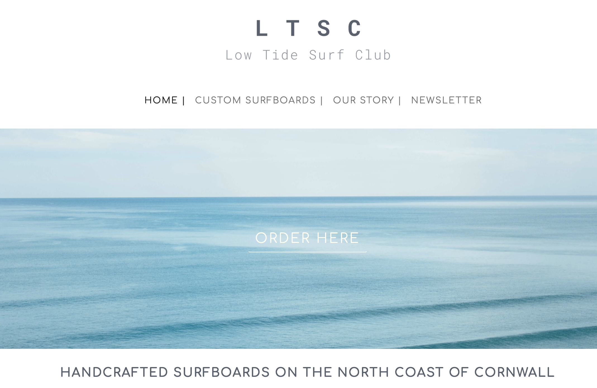

    - For the user to find out more in depth information about the business they only have to scroll down to the first section on the landing page where the 'Why Us' section
    will tell them everything about the company and brand.

    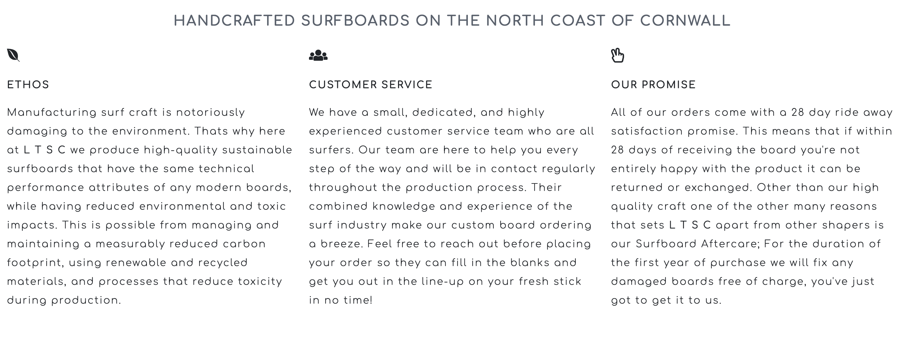

- *"As a first time visitor, I want to be able to easily find the product information that I visited the site for.
    Also have an enjoyable experience aesthetically and find using the websites features simple."*
    
    - Product information can be easily found on the landing page in the 'Why Us' and the 'Surfers Stories' testimonial sections. Further product information can be found on the 'Our Story'
    page easily found in the navigation bar.

    - The website has been kept simple and clean with good aesthetics, clear imagery, good flow, minimal colours and other possible distractions avoided such as overuse of icons and other elements.

- *"As a first time visitor, I want to look for previous products created to ensure that using this company is the right decision, I would expect to find these not only through 
    social media links but also a gallery page. Also providing customer testimonials would enhance this."*

    - There are plenty of images used displaying the products on all pages, to enhance this in the future I would like to add a page that goes into more detail about specific products.

    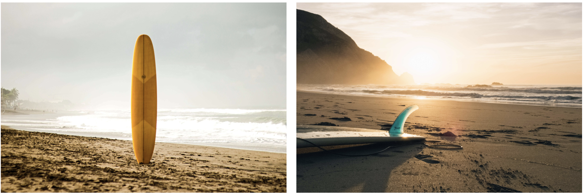

    - Social media links are present multiple times on the landing page as well as featured in the footer on all pages. 

    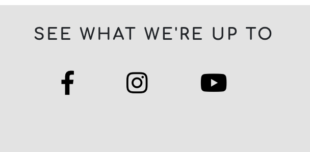

    - Initially I had planned to create a separate page for testimonials but on further research I decided that the preferred industry standard was to place them on the landing page
    to be viewed as one of the first sections for a user. This then adds to the instant information the user receives and increases the chances of them using this business.

    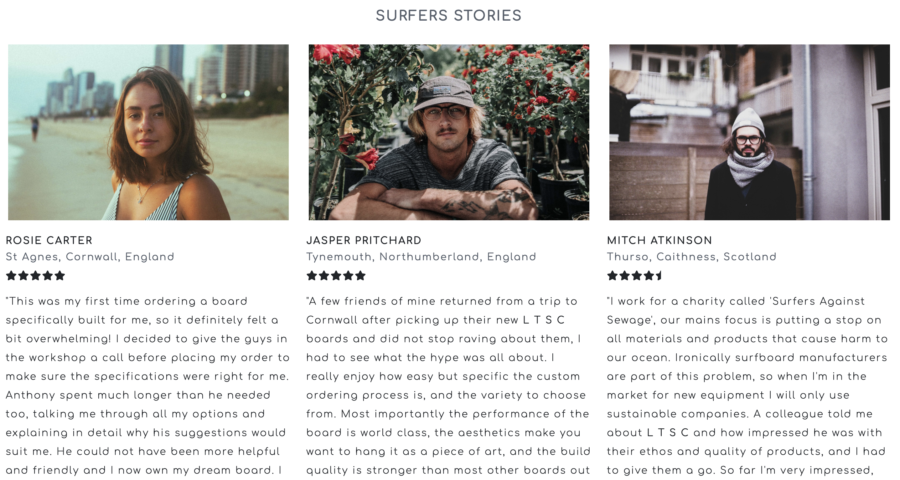

#### Returning Visitor Goals Testing

- *"As a returning visitor, I want to be able to easily order a product custom to my specifications in a
    reasonably quick manor."*

    - This can be done simply by using the navigation bar or call to action button placed over the hero image. The CTA button is visible on all screen sizes to reduce the amount of 
    clicks needed to navigate to the ordering page if the navigation bar has collapsed into the hamburger icon.

    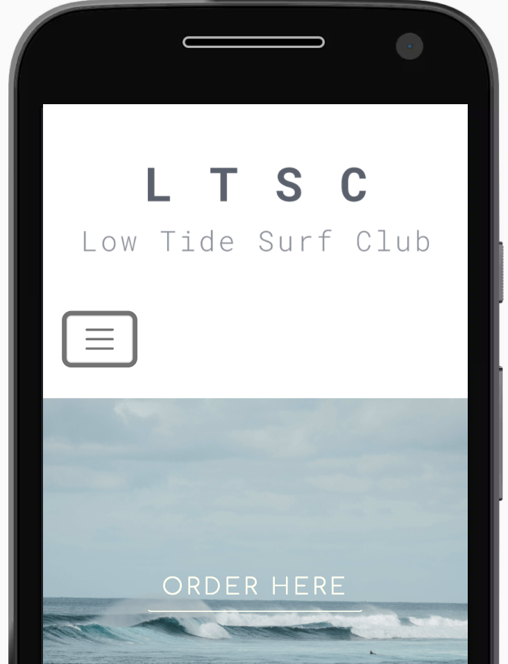

- *"As a returning visitor, I want to be able to find alternative ways to contact the company other than the order
    form. This is in case of needing to alter my order, or to request an update."*

    - Alternative contact can be found in the footer on all pages, this includes address, telephone number and a direct line email address. In the future I plan to make a separate contact
    form page.

    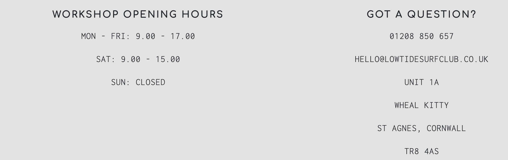

- *"As a returning visitor, I want to be able to find out further information about the company and brand. This
    includes new products, design and background history."*

    - All of this information can be found on the about/our story page which also includes imagery to add to the visual information regarding the production that a returning user
    will want to know.

    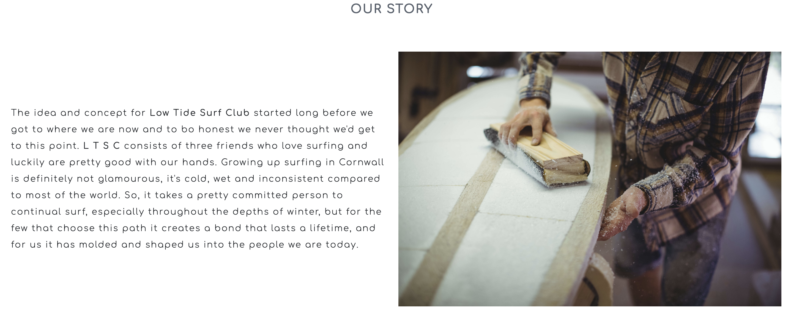

#### Frequent Visitor Goals Testing

- *"As a frequent visitor, I want to easily be able to sign up to a newsletter so that I always find out about 
    upcoming changes/information via email."*

    - This has been implemented in two ways, I decided to add a modal that opens when the 'Newsletter' link is clicked on the navigation bar. The reason I added the modal in this way
    was so that if a first time user was not yet interested in signing up to a newsletter they did not have this interrupting their viewing of the website and negatively effecting their
    user experience. 

    
    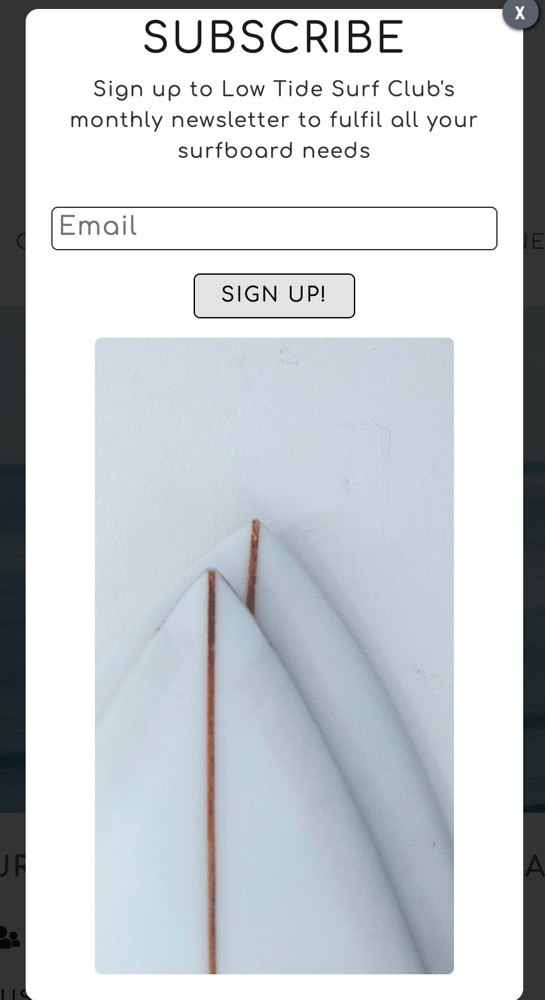

    - The second way this implemented was by adding a simple form to the footer, this is only viewable on devices smaller than a standard laptop screen. The reason for this is it goes
    against industry standard to have modals appearing on smaller devices.

    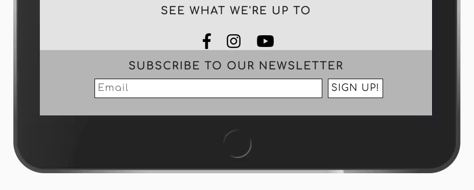

- *"As a frequent visitor, I want to be able to find further social media links to be able to follow on 
    multiple platforms."*

    - With Instagram being the primary social media platform that this business aims at it's consumers this link features twice on the landing page. The first time it a eye catching header
    link above the gallery section, then once again in the footer. All other social media platform links are also featured in the footer in a predominant way.

    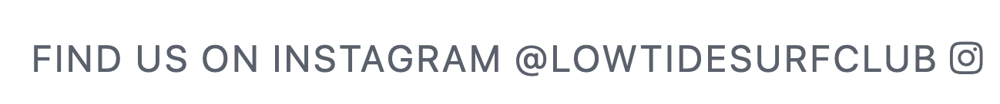