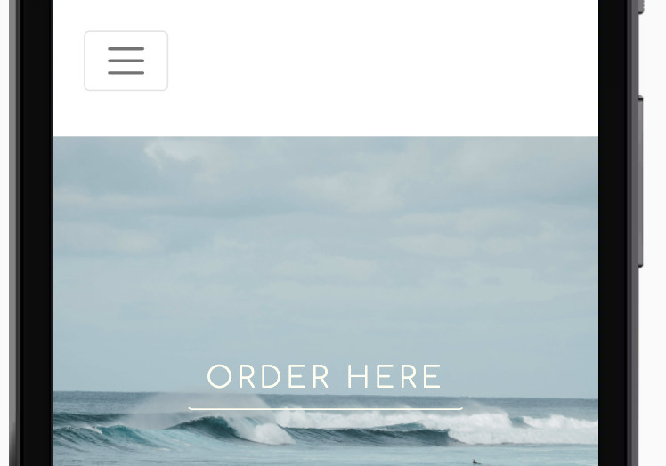
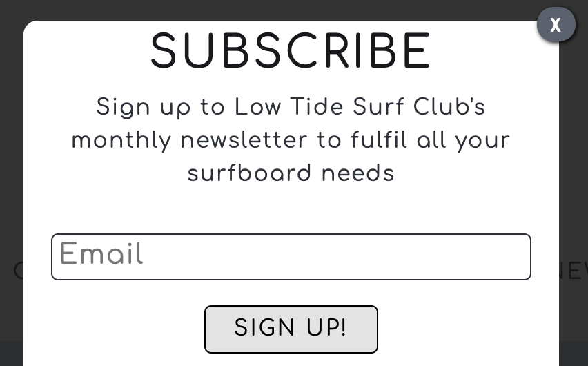

## Testing Table of Contents
### 1. [Code Validation](#code-validation)
### 2. [User Story Testing](#user-story-testing)
- [First Time Visitor Goals Testing](#first-time-visitor-goals-testing)
- [Returning Visitor Goals Testing](#returning-visitor-goals-testing)
- [Frequent Visitor Goals Testing](#frequent-visitor-goals-testing)
### 3. [Browser Compatibility and Device Responsiveness Testing](#browser-compatibility-and-device-responsiveness-testing)
### 4. [Google Lighthouse Testing](#google-lighthouse-testing)
### 5. [Further Testing](#further-testing)
### 6. [Bugs](#bugs)

---

### Code Validation

Continually throughout the project I would test my code through both the W3C validators to ensure syntax was correct before moving on. Once the project was completed all code was ran 
through once more to check, all code has passed with no errors as seen in below.

[HTML Validation Results](testing/html-validation.pdf)

[CSS Validation Results](testing/css-results.png)

---

### User Story Testing

#### First Time Visitor Goals Testing

- *"As a first time visitor, I want to gain understanding of the purpose for this site and the intentions of the
    business, there should be explanative information in case the user does not having a strong understanding of the product."*

    - By using a logo that contains the word 'Surf' straight away this gives the user an idea of what this company are involved in. The first image used
    with the call to action button placed over the top with the header below 'Handcrafted Surfboards on the North Coast of Cornwall' has now informed the user
    exactly what this companies purpose is. 

    

    - For the user to find out more in depth information about the business in case of having a lack of surfboard knowledge, they only have to scroll down to the first 
    section on the landing page where the 'Why Us' section will tell them everything about the company and brand.

    

- *"As a first time visitor, I want to easily find out about products that I have visited this site for."*
    
    - Product information can be easily found on the landing page in the 'Why Us' and the 'Surfers Stories' testimonial sections. Further product information can be found on the 'Our Story'
    page easily found in the navigation bar.

    - The website has been kept simple and clean with good aesthetics, clear imagery, flow, minimal colours and other possible distractions avoided such as overuse of icons and other elements.

- *"As a first time visitor, I want to look for previous products created to ensure that using this company is the right decision."*

    - There are plenty of images used displaying the products on all pages, to enhance this in the future I would like to add a page that goes into more detail about specific products.

- *"As a first time visitor, the website providing customer great testimonials would enhance my interest in using this company."*

    - Initially I had planned to create a separate page for testimonials but on further research I decided that the preferred industry standard was to place them on the landing page
    to be viewed as one of the first sections for a user. This then adds to the instant information the user receives and increases the chances of them using this business.

    

---

#### Returning Visitor Goals Testing

- *"As a returning visitor, I want to be able to easily order a product custom to my specifications in a reasonably quick manor."*

    - This can be done simply by using the navigation bar or call to action button placed over the hero image. The CTA button is visible on all screen sizes to reduce the amount of 
    clicks needed to navigate to the ordering page if the navigation bar has collapsed into the hamburger icon.

    

- *"As a returning visitor, I want to be able to find alternative ways to contact the company other than the order form."*

    - Alternative contact can be found in the footer on all pages, this includes address, telephone number and a direct line email address. In the future I plan to make a separate contact
    form page.

    

- *"As a returning visitor, I want to be able to find out further information about the company and brand."*

    - All of this information can be found on the about/our story page which also includes imagery to add to the visual information regarding the production that a returning user
    may want to know.

    

---

#### Frequent Visitor Goals Testing

- *"As a frequent visitor, I want to easily be able to sign up to a newsletter or blog."*

    - This has been implemented in two ways, I decided to add a modal that opens when the 'Newsletter' link is clicked on the navigation bar. The reason I added the modal in this way
    was so that if a first time user was not yet interested in signing up to a newsletter they did not have this interrupting their viewing of the website, avoiding negatively effecting the
    user experience. 

    
    

    - The second way this implemented was by adding a simple form to the footer, this is only viewable on devices smaller than a standard laptop screen. The reason for this is it goes
    against industry standard to have modals appearing on smaller devices.

    

- *"As a frequent visitor, I want to be able to find further social media links to be able to follow on multiple platforms."*

    - With Instagram being the primary social media platform that this business aims at it's consumers this link features twice on the landing page. The first time in an eye catching header
    link above the gallery section, then once again in the footer. All other social media platform links are also featured in the footer in a predominant way.

    

    

- *"As a frequent visitor, I would like to see a gallery section including lifestyle and product images."*

    - This has been added to the bottom of the landing page as even though it is aimed at frequent users I wanted it to be easily accessible to new and frequent users due to the importance of 
    product and brand imagery. 

    

---

### Browser Compatibility and Device Responsiveness Testing

This project was continually tested on various devices and screen sizes throughout the project by using Google Chrome Developer Tools. It was also tested in real time through my own personal
device that were an Iphone 8 to ensure that testing was thoroughly checked.


Once the project was completed a cross browser compatibility test on six different browsers was carried out using a web based application [BrowserStack](https://www.browserstack.com/). I also checked this testing 
by downloading the browsers that were available to me to double check on the testing.

This table below shows how all the projects pages responded on different device screen sizes and being used on various browsers, the grading key is as follows;

- Good - Appears exactly as intended aesthetically and functionally

- OK - Appears as intended functionally but some aesthetics may have slightly altered

- Poor - Website still functions correctly but key elements do not appear as intended


---

### Google Lighthouse Testing

Once the main build of this project was completed a test for mobile and web was carried out for all pages using Google Developer Tools Lighthouse application. Using the report I then 
went through the project and made as many recommended alterations as possible to improve the website inline with the areas that lighthouse focuses on.

Below are the before and after results for the landing page on web view. To see before and after results for all pages on [mobile](testing/lighthouse-mobile/lighthouse-mobile-table.png) or [web](testing/lighthouse-web/lighthouse-web-table.png) please follow the links.

**Before**


**After** 


The improvements made to the project to improve Lighthouse scores were removing unnecessary code, compressing all images using [TinyPNG](https://tinypng.com/) to make them a more suitable 
size for a web based site, and improving the SEO by adding additional ````Meta```` tags and content such as project descriptions for all pages, keywords and copyright.

---

### Further Testing

- All functionality and features of the entire website have been thoroughly tested, this includes all links internal and external, as well
as all forms.

- The live site was viewed and reviewed in the [Code Institute](https://codeinstitute.net/) Slack channel for 'peer-code-review' where only a couple of
minor changes were mentioned. One of these was to make the call to action button over the hero image on the landing page and about/our story page visible on 
all screen sizes which has now been implemented in the final version.

- My peers that are also studying this course and started around a similar time also tested this project which found some responsiveness problems
on Ipad Pro screen sizes, and xl desktop screen sizes which were then corrected.

---

### Bugs 

Listed below are the major bugs that I encountered whilst building this project and how I resolved them.

1. One of the most time consuming issues in this project was ensuring that the responsiveness of the site worked well on the Ipad Pro device, I was attempting to fix any issues by 
targeting what I believed to be the correct media query for this device. Through thorough research on various websites such as [w3 schools,](https://www.w3schools.com) [Stack Overflow,](https://stackoverflow.com/)
and [CSS Tricks](https://css-tricks.com/) I tried various different media queries aimed at this device and still it did not target the website when used on this device. Finally, I took to
the [Code Institute](https://codeinstitute.net/) tutor support where the first tutor also could not work out the problem, his colleague did very simply find the solution;

````
    @media only screen 
  and (min-width: 1024px) and (max-width: 1026px)
  and (max-height: 1366px) 
  and (-webkit-min-device-pixel-ratio: 1.5)
````

By adding the (max-height) to the media query it fixed the bug allowing me to correct any responsive bugs being caused when the website was viewed on an Ipad Pro screen size.

2. When it was suggested to me that keeping my call to action button visible on all devices I came across a bug that firstly didn't keep the button centered on various sized devices.
Then even if it did happen to be aligned to the center when the hamburger navigation bar was opened the button would move and be placed over the links. By going back through some course
documentation along with some online research on aligning and positioning I resolved the bug with the following code.

````
.cta {
    position: relative;
    top: 50%;
    left: 50%;
````
3. When testing the live project on my mobile device I found that fixed background images appeared and functioned differently to how they did when inspecting using Google Developer Tools.
I decided that they were not working well and after some research into CSS tricks with background images I created multiple media queries covering all devices, screen sizes, and screen
orientation and set the background images on all pages to ````background-attachment: scroll;```` fixing the bug.

[Back to ReadMe](README.md)